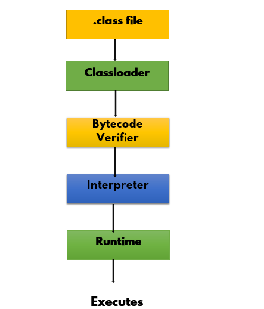

# __Java Bytecode__
Whenever a ```.java``` file is compiled by a Java compiler, it generates a ```.class``` file, i.e., Bytecode. It can be considered as machine code in the form of a ```.class``` format. Bytecode is an instruction set for the Java Virtual Machine(JVM).

# Internal working of Java Program

When you make a ```.java``` file, firstly, the Java compiler compiles it and generates a ```.class``` file. Now the generated Bytecode is run by the Java Virtual Machine(JVM) without any involvement from the operating system or processor. All the resources which are required to run the bytecode are always made available by the Java Virtual Machine, which itself calls the processor to allocate the required resources.


# What happens at __Runtime__?

Java Virtual machine is a virtual machine that provides __Java bytecode__ with a runtime enviroment in which it can be executed. It can also run codes which are written in other language and generate __Java bytecode__.

At runtime, JVM does the following tasks:

- Loads all the ```.class``` file, whenever a you run a java program, it is first loaded by a __Classloader__ present in JVM.
- Verifies the __Bytecode__, so that the access rights to objects is not violated by the code.
- Provides runtime enviroment and executes the __bytecode__.



#  Commands for Compiling and Running Java Program
For Compiling:
```
javac name.java
```
For executing:
```
java name
```

# Advantages of __Java Bytecode__

- __Java Bytecode__ is one of the reasons that makes Java, a __platform-independent__ langauge. Thus, Bytecode is a very essential component of any java program.
- A set of instruction for JVM may differ from system to system but they all can interpret bytecode.
- A bytecode is non-runnable code that totally relies only on JVM to interpret it and get it execute.
- It gives Java program portablity i.e __Write Once, read anywhere__(WORA).

# Difference between Machine Code & Java Bytecode

- Machine code is a set of instruction written in either machine language or in binary form, which directly gets executed by the CPU.
- Bytecode is a non-runnable code that totally relies on JVM to interpret it and get it execute.

# Conclusion
You've successfully learnt about __Java Bytecode__.

Keep exploring Java :wave:

Contributor : [Abhinandan Adhikari](https://github.com/AbhinandanAdhikari) :heart: